# Сети в Linux

## Part 1. Инструмент **ipcalc**

#### 1.1. Сети и маски

- Адрес сети *192.167.38.54/13* - 192.160.0.0.

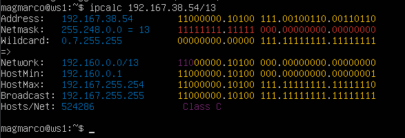

- Перевод маски *255.255.255.0* в префиксную - 24. В двоичную запись - 11111111.11111111.11111111.00000000.

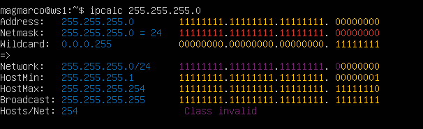

- */15* в обычную 255.254.0.0. И двоичную - 11111111.11111110.00000000.00000000.

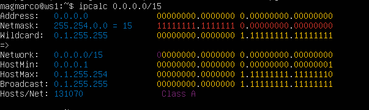

- *11111111.11111111.11111111.11110000* - 255.255.255.240. В префиксную - 28.

- Минимальный и максимальный хост в сети *12.167.38.4* при масках: */8*.

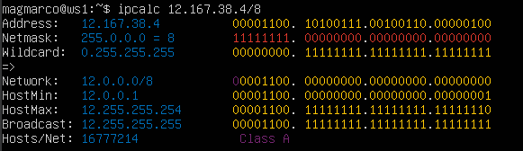

- *11111111.11111111.00000000.00000000*. 

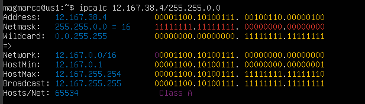

- *255.255.254.0*.

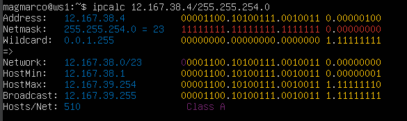

- */4*.

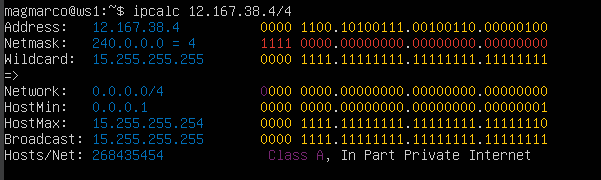

#### 1.2. localhost
##### Определи и запиши в отчёт, можно ли обратиться к приложению, работающему на localhost, со следующими IP:
- *194.34.23.100* - нет,
- *127.0.0.2* - да,
- *127.1.0.1* - да,
- *128.0.0.1* - нет.

#### 1.3. Диапазоны и сегменты сетей
##### Определи и запиши в отчёт:
##### 1) Какие из перечисленных IP можно использовать в качестве публичного, а какие только в качестве частных: 
- *10.0.0.45* - частный,
- *134.43.0.2* - публичный, 
- *192.168.4.2* - частный,
- *172.20.250.4* - частный, 
- *172.0.2.1* - публичный,
- *192.172.0.1* - публичный,
- *172.68.0.2* - публичный,
- *172.16.255.255* - частный,
- *10.10.10.10* - частный,
- *192.169.168.1* - публичный.
##### 2) Какие из перечисленных IP-адресов шлюза возможны у сети *10.10.0.0/18*: 
- *10.0.0.1*,
- *10.10.0.2* - возможен, 
- *10.10.10.10* - возможен, 
- *10.10.100.1*, 
- *10.10.1.255* - возможен.

## Part 2. Статическая маршрутизация между двумя машинами

##### Подними две виртуальные машины (далее -- ws1 и ws2).

##### С помощью команды `ip a` посмотри существующие сетевые интерфейсы.

- Вывод `ip a` на ws1:

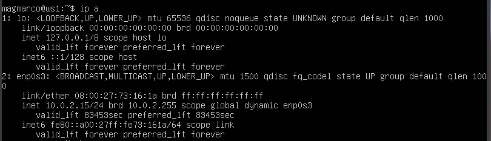

- Вывод `ip a` на ws2:

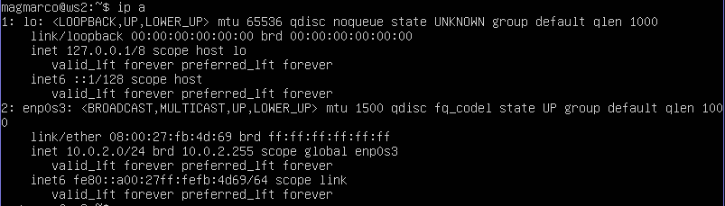

- Далее следует изменить файл etc/netplan/00-installer-config.yaml и задать следующие адреса и маски: ws1 — 192.168.100.10, маска /16.

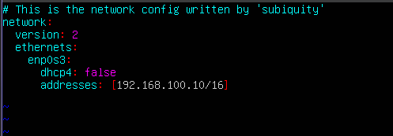

- ws2 — 172.24.116.8, маска /12.

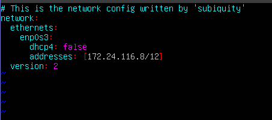

- Выполним команду `netplan apply` для перезапускa сервиса сети на ws1.

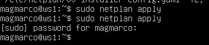

- На ws2.

#### 2.1. Добавление статического маршрута вручную

- Добавим статический маршрут от одной машины до другой и обратно при помощи команды `ip r add`. Далее пропингуем соединение между машинами.

- На ws1.

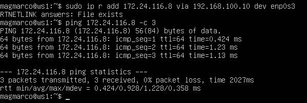

- На ws2.

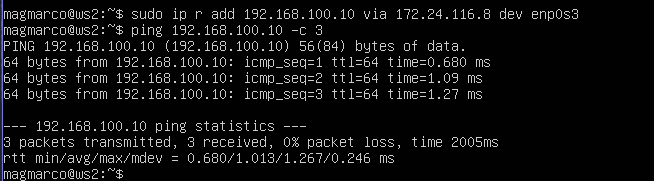

#### 2.2. Добавление статического маршрута с сохранением

- Добавим статический маршрут от одной машины до другой с помощью файла /etc/netplan/00-installer-config.yaml.

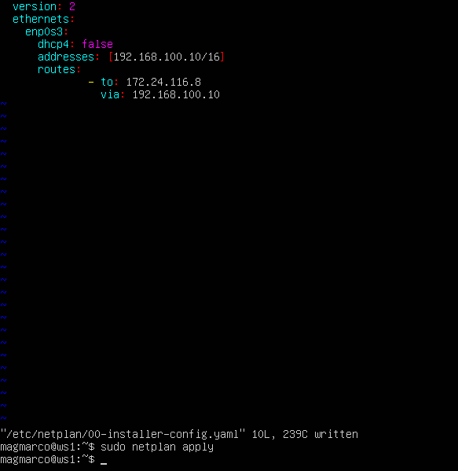

- На ws2.

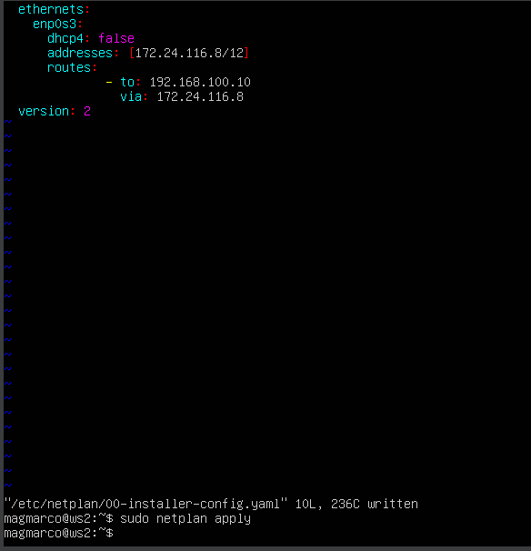

- Пропингуем соединение между машинами на ws1.

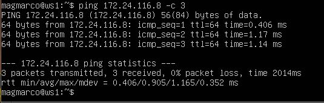

- Пропингуем соединение между машинами на ws2.

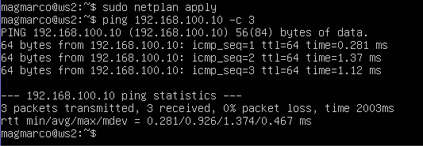

## Part 3. Утилита **iperf3**

#### 3.1. Скорость соединения

*8 Mbps = 1 MB/s*,
*100 MB/s = 800 000 Kbps*,
*1 Gbps = 1000 Mbps*.

#### 3.2. Утилита **iperf3**

- Измерим скорость соединения между ws1 и ws2.

- На ws1.

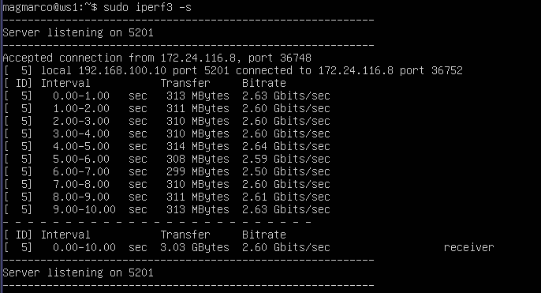

- На ws2.

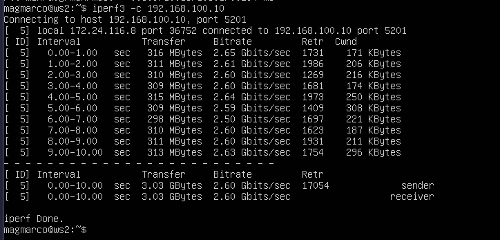

## Part 4. Сетевой экран

- Создадим файл /etc/firewall.sh, имитирующий файрвол, на ws1.

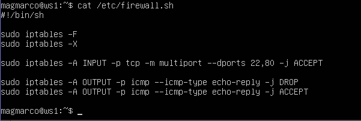

- На ws2.

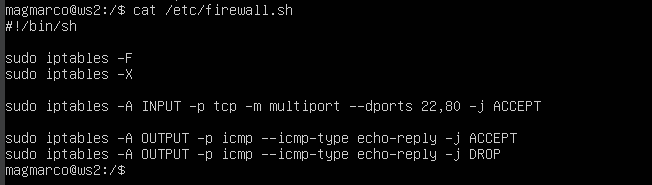

- Запустим файлы на обеих машинах командами chmod +x /etc/firewall.sh и /etc/firewall.sh.

- ws1.

- ws2.

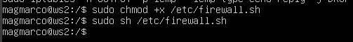

Разница в том, что для машины ws1 первой стоит команда DROP. Будет выполнятся этот запрет и пинг не пройдет. Для машины ws2 напротив, первым стоит ACCEPT. Применяется только первое подходящее правило, остальные игнорируются.

#### 4.2. Утилита **nmap**

- Командой ping найдём машину, которая не «пингуется».

- Скрин с вызовом и выводом использованной команды ping на ws1.

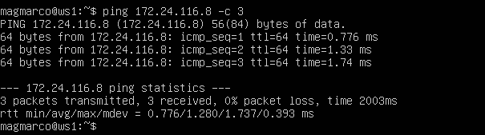

- Команда nmap на ws1.

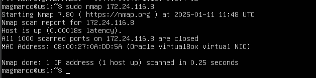

- Скрин с вызовом и выводом использованной команды ping на ws2.

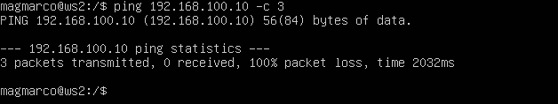

- Команда nmap на ws2.

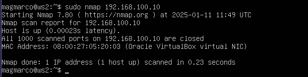

## Part 5. Статическая маршрутизация сети

#### 5.1. Настройка адресов машин

##### Поднимим пять виртуальных машин (3 рабочие станции (ws11, ws21, ws22) и 2 роутера (r1, r2)). Настроим конфигурации машин в etc/netplan/00-installer-config.yaml. Выполним команду `sudo netplan apply` для перезагрузки сетевой службы.

- ws11.

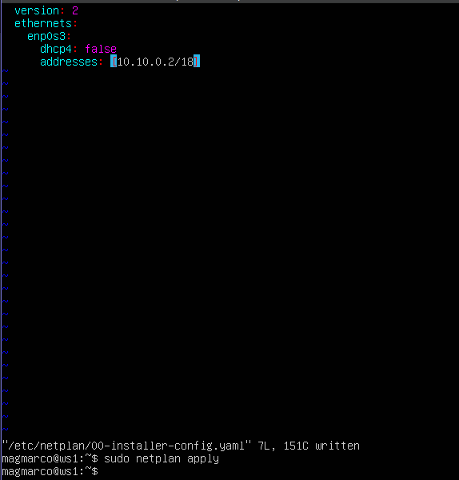

- ws21.

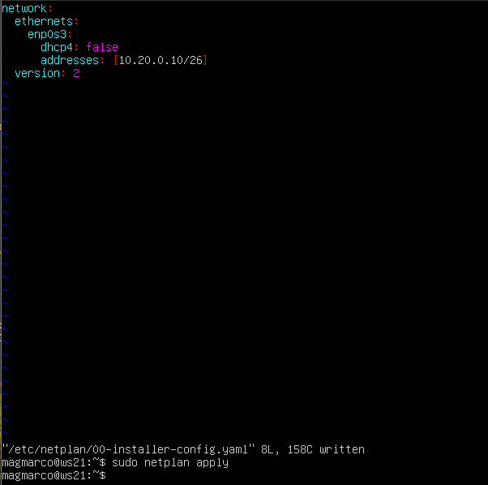

- ws22.

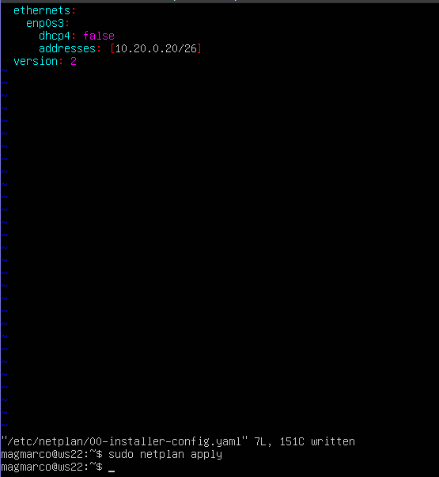

- r1.

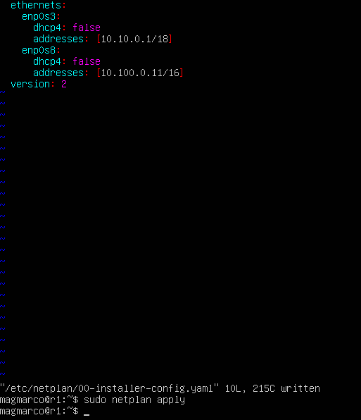

- r2.

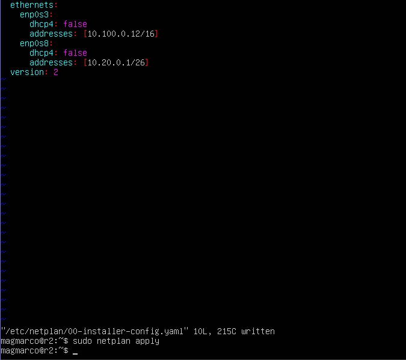

##### Перезапустим сервис сети. Командой ip -4 a проверим, что адрес машины задан верно.

- ws11.

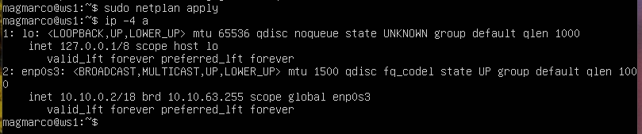

- ws21.

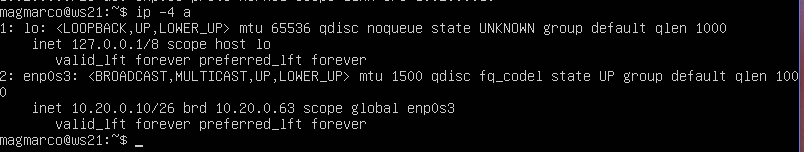

- ws22.

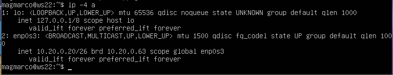

- r1.

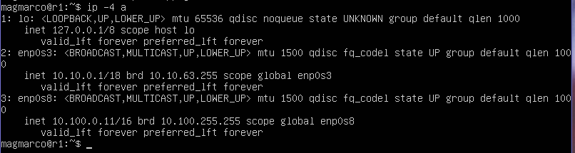

- r2.

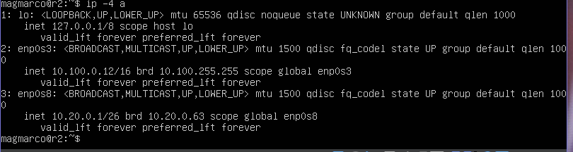

- Пропингуем ws22 с ws21.

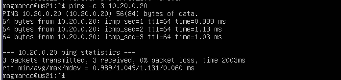

- Аналогично пропингуем r1 с ws11.

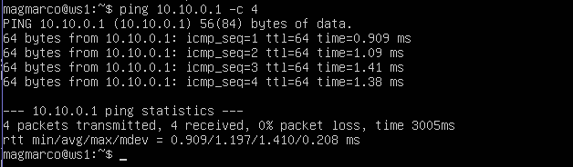

#### 5.2. Включение переадресации IP-адресов

##### Для включения переадресации IP выполним команду `sysctl -w net.ipv4.ip_forward=1` на роутерах.

- на r1.

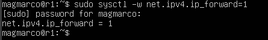

- на r2.

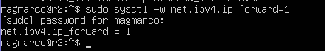

##### Откроем файл */etc/sysctl.conf* и добавь в него следующую строку `net.ipv4.ip_forward = 1`.

- на r1.

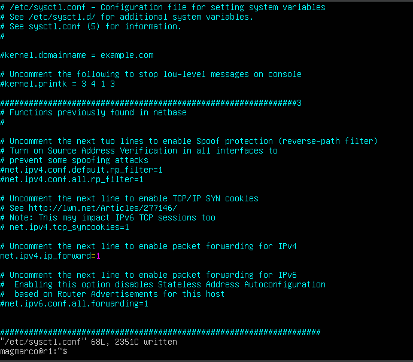

- на r2.

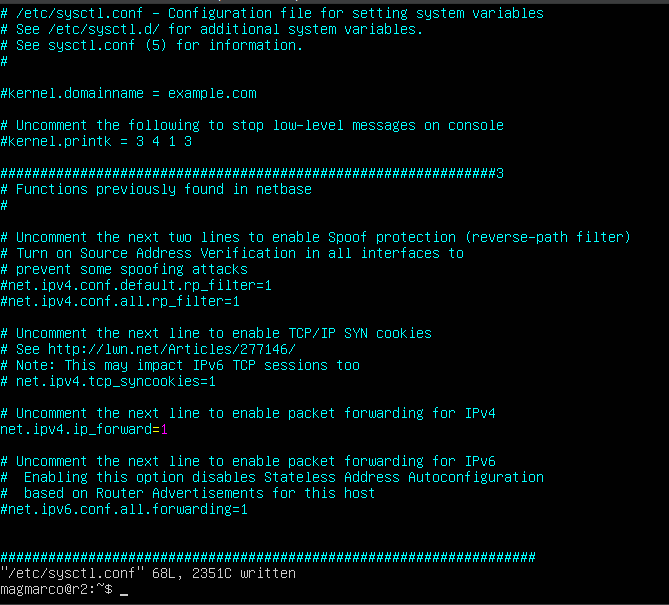

#### 5.3. Установка маршрута по умолчанию

##### Настроим маршрут по умолчанию (шлюз) для рабочих станций. Для этого нужно добавить `default` перед IP-роутера в файле конфигураций.

- ws11.

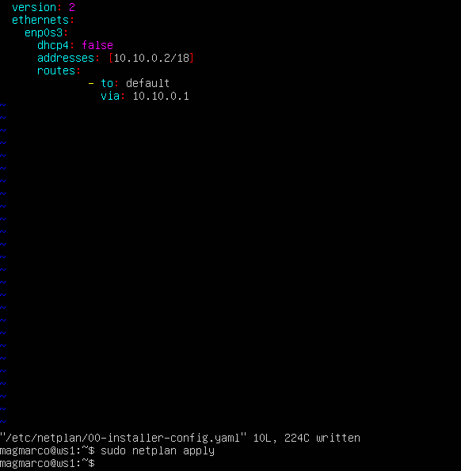

- ws21.

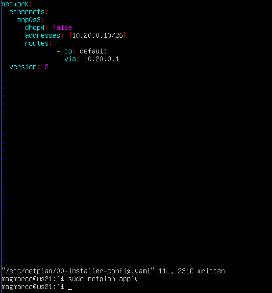

- ws22.

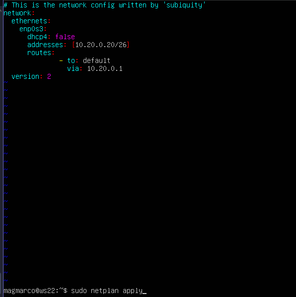

##### Вызовим `ip r`. Маршрут добавился в таблицу маршрутизации.

- ws11.

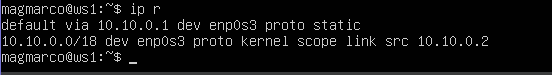

- ws21.

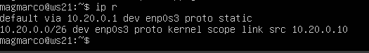

- ws22.

- Пропингуем с ws11 роутер r2.

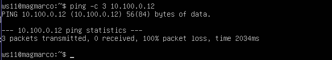

- Покажим на r2, что пинг доходит. Для этого используем команду `tcpdump -tn -i enp0s3`.

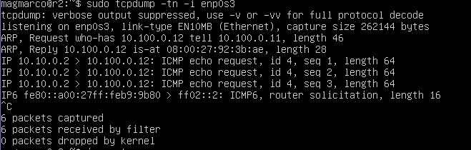

#### 5.4. Добавление статических маршрутов

##### Добавим в роутеры r1 и r2 статические маршруты в файле конфигураций.

- r1.

- r2.

- Вызовим команду `ip r` на r1.

- r2.

- Запустим команды `ip r list 10.10.0.0/[маска сети]` и `ip r list 0.0.0.0/0` на ws11.

При наличии двух и более маршрутов выбирается маршрут с самой длинной маской т.к. он более точный.

#### 5.5. Построение списка маршрутизаторов

- Запустим на r1 команду дампа командой `tcpdump -tnv -i enp0s3`.

- При помощи утилиты traceroute построим список маршрутизаторов на пути от ws11 до ws21.

Протокол пользовательских датаграмм (UDP) и протокол межсетевых управляющих сообщений (ICMP) отправляют серию пакетов с постепенно увеличивающимся значением Time to Live (TTL) - это количество узлов, которые может пройти пакет перед тем, как он будет уничтожен.  Идея заключается в том, что если отправить пакет с TTL=1, то он будет отклонён на первом маршрутизаторе в сети и вы получите сообщение об ошибке ICMP «Time-to-live exceeded». Затем отправляем пакет с TTL=2, и он отклоняется на втором маршрутизаторе — и так далее. Таким образом, мы используем исходный IP-адрес и тайминги сообщений о превышении времени TTL для построения нашего списка путей.

#### 5.6. Использование протокола **ICMP** при маршрутизации

- Запустим на r1 перехват сетевого трафика, проходящего через eth0 с помощью команды `tcpdump -n -i enp0s3 icmp`.

- Пропингуем с ws11 несуществующий IP (например, *10.30.0.111*) с помощью команды `ping -c 1 10.30.0.111`.

## Part 6. Динамическая настройка IP с помощью **DHCP**

- Для r2 следует настроить в файле */etc/dhcp/dhcpd.conf* конфигурацию службы **DHCP**:

- Укажим адрес маршрутизатора по умолчанию, DNS-сервер и адрес внутренней сети.

- В файле *resolv.conf* пропишим `nameserver 8.8.8.8`.

- Перезагрузим службу **DHCP** командой `systemctl restart isc-dhcp-server`.

- Перезагрузим ws21 при помощи `reboot` и через `ip a` покажим, что она получила адрес.

- Пропингуем ws22 с ws21.

- Укажим MAC-адрес у ws11, для этого изменим настройки сети виртуальной машины

- В *etc/netplan/00-installer-config.yaml* надо добавить строки: `macaddress: 10:10:10:10:10:BA`, `dhcp4: true`.

- Для r1 настроим аналогично r2, но сделаем выдачу адресов с жесткой привязкой к MAC-адресу (ws11). Перезагрузим службу **DHCP** командой `systemctl restart isc-dhcp-server`.

- В файле *resolv.conf* пропишим `nameserver 8.8.8.8`.

- После перезагрузки ws11 используем команду `ip a`. 

- Запросим с ws21 обновление IP-адреса. Используем команду `dhclient -r enp0s3`, чтобы удалить старый ip. Запустим `dhclient -v enp0s3` для запроса нового ip.

- До обновления.

- После обновления.

## Part 7. **NAT**

- В файле */etc/apache2/ports.conf* на ws22 изменим строку `Listen 80` на `Listen 0.0.0.0:80`, то есть сделаем сервер Apache2 общедоступным.

- На r1.

- Запустим веб-сервер Apache командой `service apache2 start` на ws22.

- На r1.

- Добавим в фаервол, созданный по аналогии с фаерволом из Части 4, на r2 следующие правила:
##### 1) Удаление правил в таблице filter — `iptables -F`;
##### 2) Удаление правил в таблице «NAT» — `iptables -F -t nat`;
##### 3) Отбрасывать все маршрутизируемые пакеты — `iptables --policy FORWARD DROP`.

- Запустим файл также, как в Части 4.

- Проверим соединение между ws22 и r1 командой `ping`.

- Разрешим маршрутизацию всех пакетов протокола **ICMP**.

- Проверим соединение между ws22 и r1 командой `ping`.

- Добавим ещё два правила.  Включим **SNAT**, а именно маскирование всех локальных IP из локальной сети, находящейся за r2. Включим **DNAT** на 8080 порт машины r2 и добавим к веб-серверу Apache, запущенному на ws22, доступ извне сети.

- Проверим соединение по TCP для **SNAT**: для этого с ws22 нужно подключиться к серверу Apache на r1 командой:
`telnet [адрес] [порт]`.

- Проверим соединение по TCP для **DNAT**: для этого с r1 подключиться к серверу Apache на ws22 командой `telnet` (обращаться по адресу r2 и порту 8080).

## Part 8. Дополнительно. Знакомство с **SSH Tunnels**

- Запустим на r2 фаервол с правилами из Части 7.

- Запустим веб-сервер **Apache** на ws22 только на localhost (то есть в файле */etc/apache2/ports.conf* надо изменить строку `Listen 80` на `Listen localhost:80`).

- Запустим веб-сервер Apache.

- Воспользуемся *Local TCP forwarding* с ws21 до ws22, чтобы получить доступ к веб-серверу на ws22 с ws21.

- Доступ к веб-серверу на ws22 получен.

- Воспользуемся Remote TCP forwarding c ws11 до ws22, чтобы получить доступ к веб-серверу на ws22 с ws11.

- Доступ к веб-серверу на ws22 получен.

- Для проверки, сработало ли подключение в обоих предыдущих пунктах, перейди во второй терминал (например, клавишами Alt + F2) и выполни команду `telnet 127.0.0.1 [локальный порт]`.

- ws21.

- ws11.

